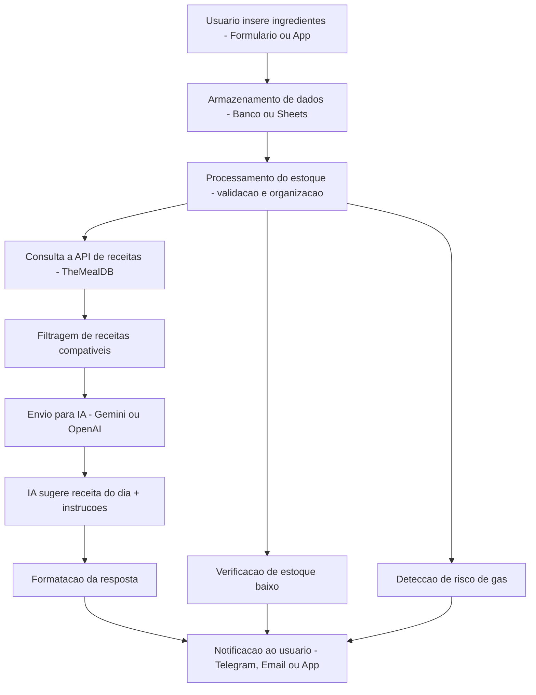

# Smart-Chef

## Sobre o Projeto
**Projeto:** Smart-Chef
**Problema que resolve:** Impraticidade

## Integrantes
| Nome | GitHub |
|------|--------|
| [Matheus Augusto Furian Martins] | [@urlfurian] |
| [Miguel Franco Nardy] | [@MiguelNardy07] |
| [João Victor da Silva Santos] | [@JoãoVictor0102] |

## Arquitetura

